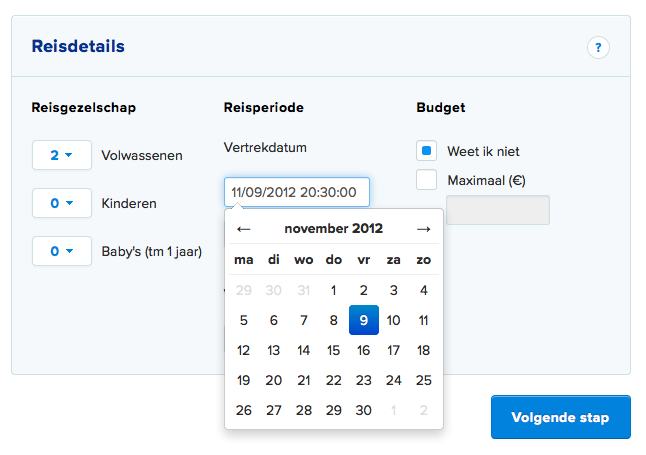

My bootstrap date/time picker
=============================

A simple, no-frills date/time picker for use with Twitter Bootstrap. Based on the work of
Stefan Petre, who made a wonderful datepicker. I merely added some features (customizable names of weekdays and months for international use, support for date/time).



Use
-------

Programmatically:

```javascript
$("input").datepicker({
	format: 'mm/dd/yyyy hh:ii:ss',
	weekStart: 1,
	days: ["zo","ma","di","wo","do","vr","za"],
	months: ["januari","februari","maart","april","mei","juni","juli","augustus","september","oktober","november","december"]
});
```

Or by using the *data-datepicker-format* attribute.

```html
<input type="text" data-datepicker-format="dd/mm/yyyy" />
```